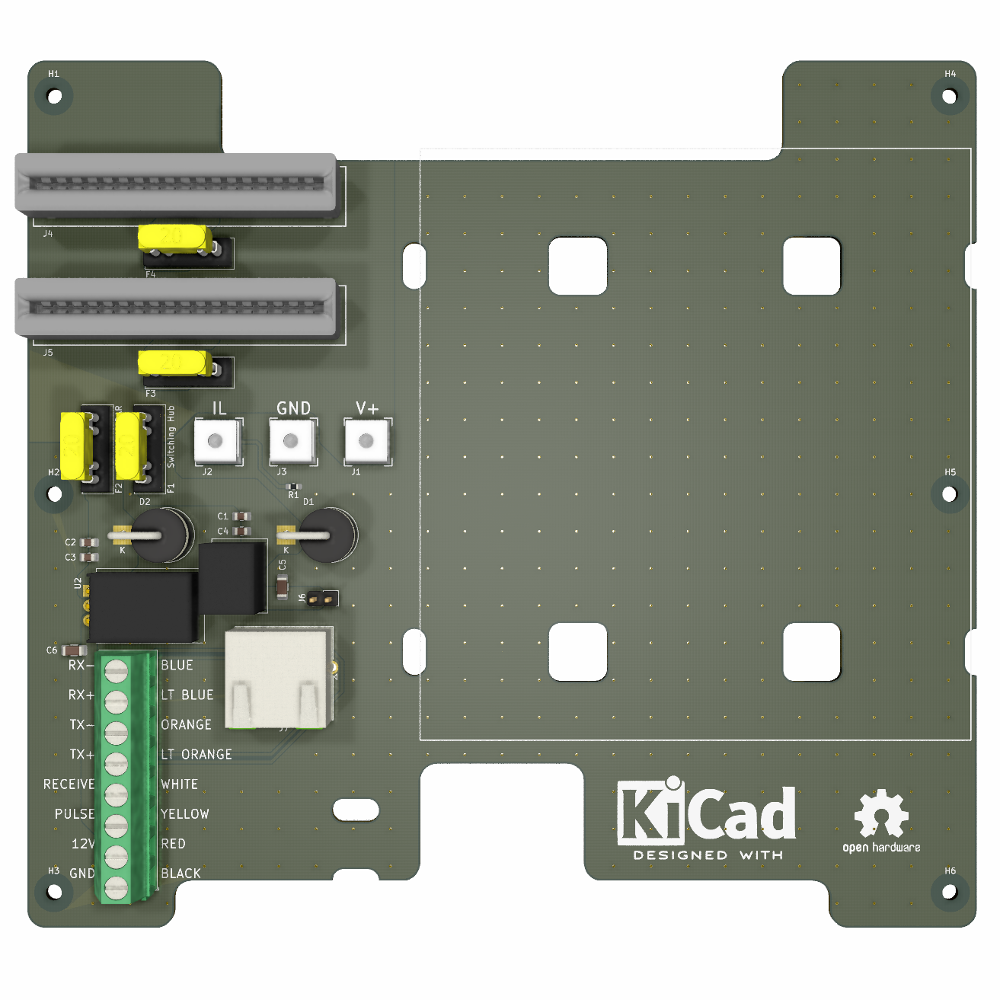

# perception-array-interface-box

## Overview

This is one of the boards that comprise the sensor unit for the RobotX2022 under development by OUXT. This sensor unit is a  "Perception Array", which is a hardware integration of two visible light cameras and a LiDAR (VLP-16) for sensor fusion. This board is installed in a box that relays the LAN and power cables of these three sensors.

## PCB rendering image

