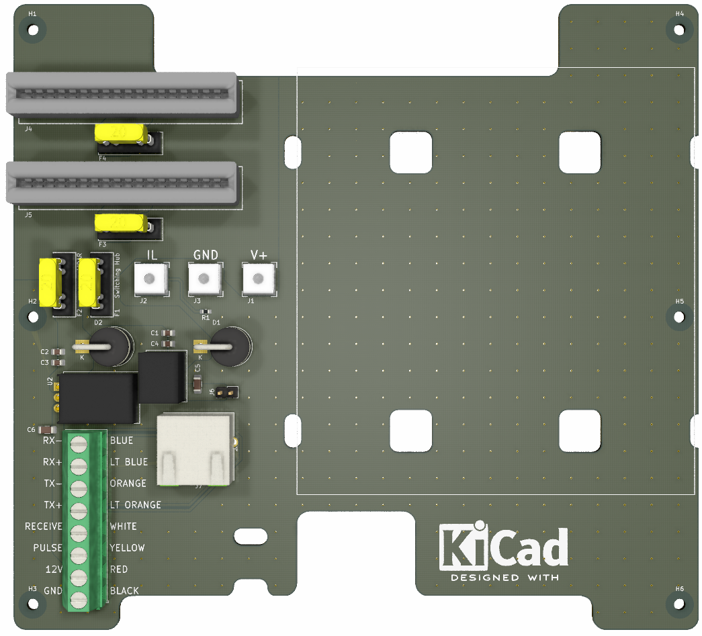
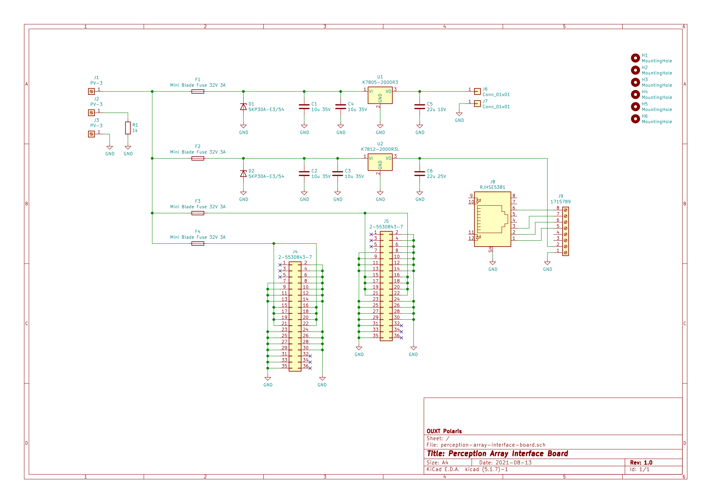

# perception-array-interface-board

## Overview

This is one of the boards that comprise the sensor unit for the RobotX2022 under development by OUXT. This sensor unit is a  "Perception Array", which is a hardware integration of two visible light cameras and a LiDAR (VLP-16) for sensor fusion. This board is installed in a box that relays the LAN and power cables of these three sensors.

KiCAD ( https://www.kicad.org/ ) is used for circuit design and PCB layout.

## CAD

### Version

KiCAD 5.1.7

### Parts Library

The symbol libraries and footprint libraries used in this schematic and PCB layout are basically KiCAD standard libraries, but some of them are in the following repositories.

https://github.com/alnicomag/kicad-custom-lib

## PCB rendering image

## Schematics

